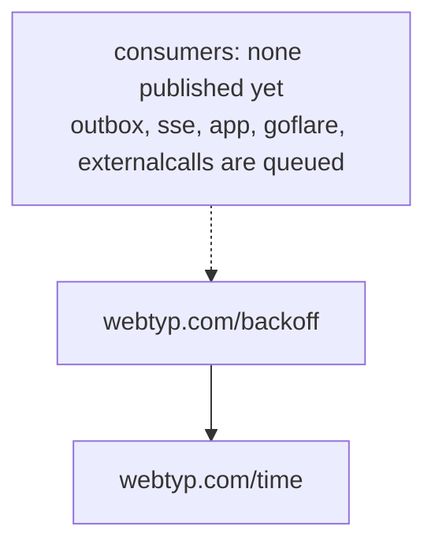

context header

```mermaid
flowchart TD
    A[webtyp.com/backoff] --> B[webtyp.com/time]
    C[consumers: none published yet<br/>outbox, sse, app, goflare, externalcalls are queued] -.-> A
```

runs in the browser and on the server, imports only `webtyp.com/time`, and nobody imports it yet.
